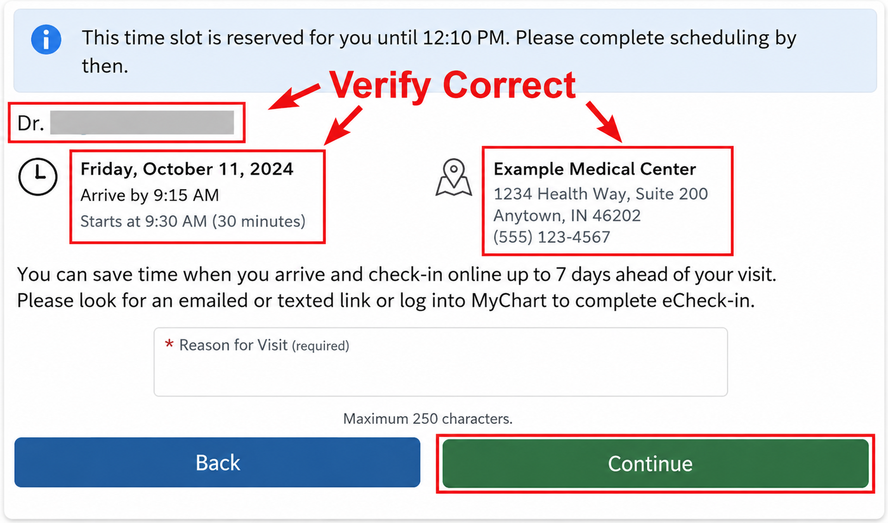
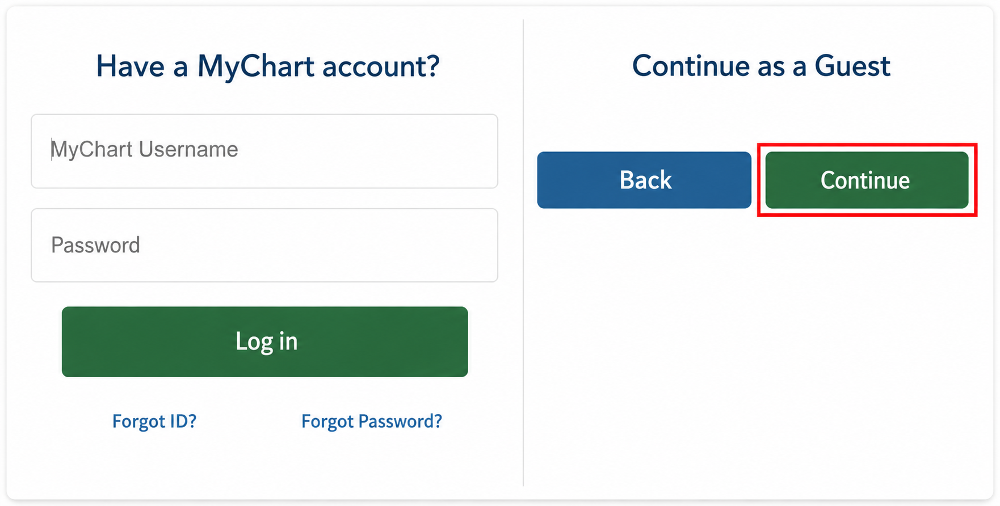
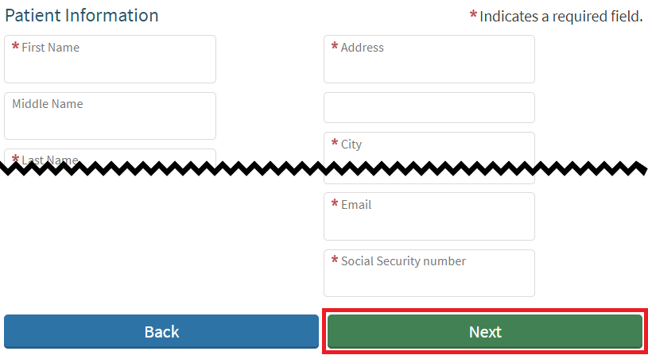
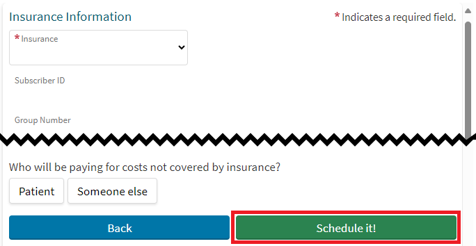
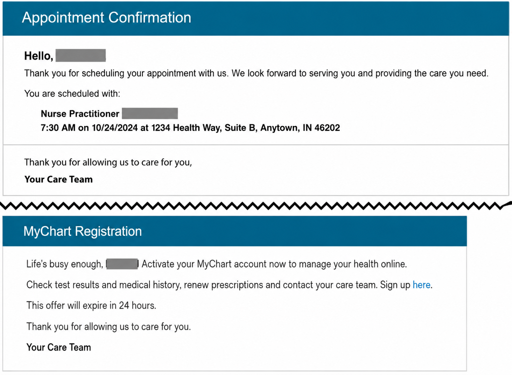

# New Patient Scheduling

This article provides procedures for scheduling new primary care patients, including insurance verification, provider selection, appointment scheduling, and escalation scenarios.

|                   |                        |
| ----------------- | ---------------------- |
| **Author**        | David Posto            |
| **Document Type** | Knowledge Base Article |
| **Audience**      | Scheduling Agents      |
| **Last Updated**  | June 2026              |

---

## Symptoms

New patient needs to schedule an appointment with a Primary Care Provider (PCP).

---

## Solution

### Pre-Step 1: Cardiac Concerns or Shortness of Breath

1. If the patient at any time expresses concern with cardiac issues or shortness of breath:

    1. Inform the caller:

        > *Your symptoms suggest a serious condition that requires immediate medical attention.*

        > *Please hang up the phone and call 911 or go to the nearest emergency room.*

    1. Close the Service Order.

---

### Pre-Step 2: Addressing Sensitive Topics

1. For information on how to address sensitive topics during calls such as gender or diagnosis, proceed to `Article 7392`.

---

### Step 1: Determine if New or Existing Patient

1. Ask the caller: *Are you needing to schedule an appointment with a new primary care provider?*

1. If Yes, proceed to Step 2.

1. If the caller is currently an existing patient:

    1. Inform the caller: *This number is for scheduling new patients.*

    1. Ask the caller: *Are you interested in scheduling with a new provider, or do you want to stay with your current provider?*

    1. If the patient wants to schedule with their current provider:

        1. **Note in the Service Order the caller is not a new patient.**

        1. Determine if the practice is open and if so, warm transfer the caller.

        1. See `Article 5814` for instructions.

        1. If the office is currently closed, proceed to Step 8.

    1. If the patient would like to schedule with a new provider, proceed to Step 2.

---

### Step 2: Gather Patient's Insurance and Determine if Accepted

1. See `Article 6271` to determine if the caller's insurance is accepted.

1. **Note the caller's insurance.**

1. If accepted:

    1. Inform the patient: *Your insurance is accepted.*

    1. Proceed to Step 3.

1. If NOT accepted, ask the caller: *Your insurance is not currently accepted. Would you still like to schedule a new appointment?*

    1. If Yes, proceed to Step 3.

    1. If No:

        1. Inform the patient: *Thank you for calling. Have a great day.*

        1. Close the Service Order.

1. If the patient does not have insurance, proceed to Step 3.

---

### Step 3: Determine which City or Town the Patient Needs to Schedule In

1. Inform the caller of the available service area locations.

1. Ask the caller: *Which area do you live closest to, or where would you like to see the provider?*

1. **Note the caller's response.**

---

### Step 4: Determine which Practice to Schedule With

1. In a separate browser tab, navigate to the **PCPs Taking New Patients & Online Scheduling** reference spreadsheet.

1. At the bottom, click on the **PCPs Taking New Patients** tab.

    1. The practices are the colored rows with the PCPs taking new patients listed below.

    1. Practices are grouped by city, with each city being a separate color.

1. In column A [City / Town], locate the city or town noted by the caller in Step 3.

1. Provide the caller the name of the practices and their location listed for the city or town to determine which the caller would like an appointment at.

    1. The practice's name is in column B [Practice / Provider].

    1. The address and location are on the same line to the right.

    1. ⚠️ The practice **must** have providers listed below it to be able to schedule a new patient.

1. If you are unable to determine what practice to schedule the caller at:

    1. If current time is Monday–Friday, 8am–4:30pm:

        1. Warm transfer the caller to the Scheduling Supervisor.

        1. Close the Service Order.

    1. If outside standard hours or the warm transfer is unsuccessful:

        1. Proceed to Step 8.

1. **Note the selected practice in the Service Order.**

---

### Step 5: Determine which Provider to Schedule With

1. If the caller requests a specific provider, try to schedule with that provider first.

1. Review the providers listed under the practice selected in Step 4.

    1. If more than one provider is listed, check in column G [Scheduling Priority] if one should be picked first.

    1. If no priority is listed, any provider listed can be selected.

1. Verify in column F [Age / Insurance] that the patient's age and insurance noted in Step 2 are accepted.

1. In column H [Special Instructions], check for any information noted and provide it to the caller.

1. If the caller requests information about the provider, a link to the provider's biographical information is available in column E [Provider Bio Link].

1. **Note the selected provider in the Service Order.**

1. Proceed to Step 6.

---

### Step 6: Select an Appointment with the Provider

1. For the selected provider, in column D [Online Scheduling Link], click the scheduling link to pull up the provider's available appointments.

    1. If the message *"Sorry, we couldn't find any open appointments."* appears:

        1. Repeat Step 5 to see if there are additional providers listed for the same practice.

        1. If no additional providers are listed for the practice, ask the caller: *Would you like to schedule an appointment at a different location?*

            1. If Yes:

                1. Repeat Steps 4.1–4.4 to determine if another practice is acceptable for the caller.

                1. If another practice is found, repeat Step 5.

            1. If No:

                1. **Note the following in the Service Order:**

                    1. The practice the patient needs scheduled at.

                    1. Dates and times the caller needs.

                1. Determine if the practice is open and if so, warm transfer the caller.

                1. See `Article 5814` for instructions.

                1. If the office is currently closed, proceed to Step 8.

1. Review the appointments with the caller to determine which appointment they would like.

1. If *"more..."* is below an appointment time, hover your mouse over it to view additional times available.

1. If an appointment is not available within 7 days:

    1. Repeat Step 5 to see if there are additional providers listed for the same practice.

    1. If no additional providers have availability at the same practice within 7 days, inform the caller of the next available appointment.

        1. If the next available appointment is acceptable, proceed to Step 6.4.

        1. If the next available appointment is NOT acceptable, ask the caller: *Would you like to schedule an appointment at a different location?*

            1. If Yes:

                1. Repeat Steps 4.3–4.7 to determine if another practice is acceptable for the caller.

                1. If another practice is found, repeat Step 5.

            1. If No:

                1. If the next available appointment is more than 2 weeks out, ask the caller:

                    > *Would you like to schedule the appointment and be put on a waitlist if a sooner appointment opens up?*

                    > *If a sooner appointment does become available, you'll receive a text notification to your cell phone notifying you.*

                    1. If Yes:

                        1. **Note the following in the Service Order:**

                            1. "SMS Waitlist opt-in"

                            1. Cellphone number.

                        1. Proceed to Step 6.4.

                    1. If No:

                        1. **Note the following in the Service Order:**

                            1. The practice the patient needs scheduled at.

                            1. Dates and times the caller needs.

                        1. Determine if the practice is open and if so, warm transfer the caller.

                        1. See `Article 5814` for instructions.

                        1. If the office is currently closed, proceed to Step 8.

                1. If the next available appointment is less than 2 weeks out:

                    1. **Note the following in the Service Order:**

                        1. The practice the patient needs scheduled at.

                        1. Dates and times the caller needs.

                    1. Determine if the practice is open and if so, warm transfer the caller.

                    1. See `Article 5814` for instructions.

                    1. If the office is currently closed, proceed to Step 8.

1. Proceed to Step 7.

---

### Step 7: Gather Patient Information and Schedule Appointment

1. Click the selected appointment.

1. In the pop-up, complete the CAPTCHA.

1. Verify the provider, appointment date and time, and location listed are correct.

1. In the *"Reason for Visit"* field, enter the caller's reason.

    1. For example, *"New patient visit"*, or if the caller mentions any additional information, enter that as well.

1. Click **Continue**.

    > 

1. On the right, under *"Continue as a Guest"*, click **Continue**.

    > 

1. On the Patient Information screen, ask for and enter the patient's information.

    1. Items listed with red asterisks (*) are required.

    1. ⚠️ **Do NOT request the patient's Social Security Number!**

        1. For the Social Security Number field, enter either *"000-00-0000"* or *"999-99-9999"*.

    1. Click **Next**.

        > 

1. On the Insurance Information screen, ask for and enter the patient's insurance information.

    1. This information can be found on their insurance card for the insurance noted in Step 2.

    1. If the caller does not have insurance, select **No Insurance**.

    1. If the caller's insurance was not listed in `Article 6271`, select **Not Listed**.

    1. Items listed with red asterisks (*) are required.

    1. FYI: *"Subscriber ID"* may appear as *"Subscriber Number"*, *"Member Number"*, *"Member ID"*, *"Policy Number"*, *"Policy ID"*, etc.

    1. Click **Schedule it!** to complete the appointment.

        > 

1. Inform the caller: *You will shortly receive an e-mail confirmation of your appointment, as well as an e-mail containing a link for your patient portal registration.*

1. If the caller's insurance was not listed in `Article 6271`:

    1. Provide the phone number to the office and offer a warm transfer if they would like to speak to someone about their insurance.

    1. If needed, see `Article 5814` for instructions to warm transfer the caller.

1. If the appointment is successfully scheduled:

    1. **Note the following in the Service Order:**

        1. "Appointment Scheduled"

        1. Appointment Date.

        1. Appointment Time.

        1. Appointment Location.

    1. Close the Service Order.

        > 

1. If unable to schedule the appointment:

    1. **Note the following in the Service Order:**

        1. The practice the patient needs scheduled at.

        1. Dates and times the caller needs.

        1. Any errors or issues.

    1. Determine if the practice is open and if so, warm transfer the caller.

    1. See `Article 5814` for instructions.

    1. If the office is currently closed, proceed to Step 8.

---

### Step 8: Escalation

1. If the issue remains unresolved, follow the appropriate escalation procedure.

1. See `Article 3956` for instructions.
